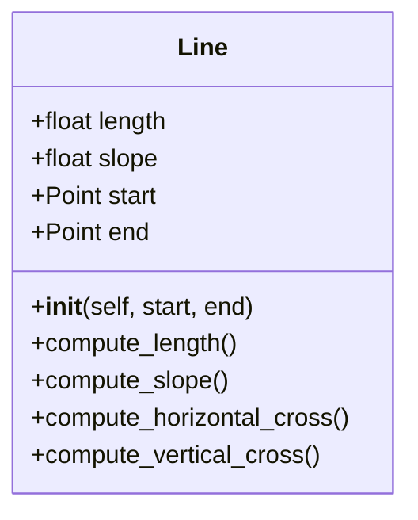
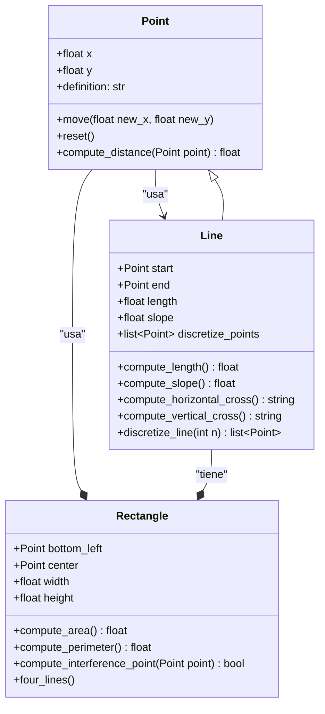
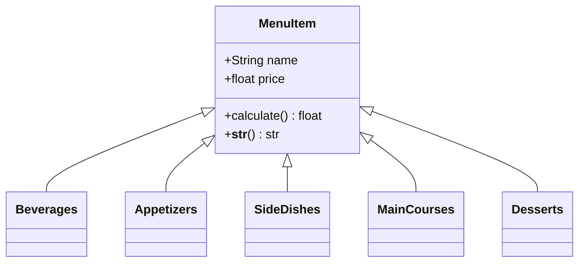
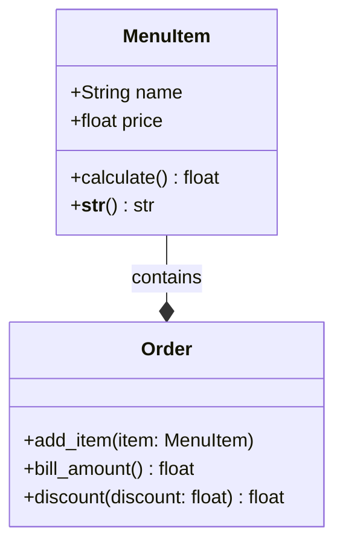
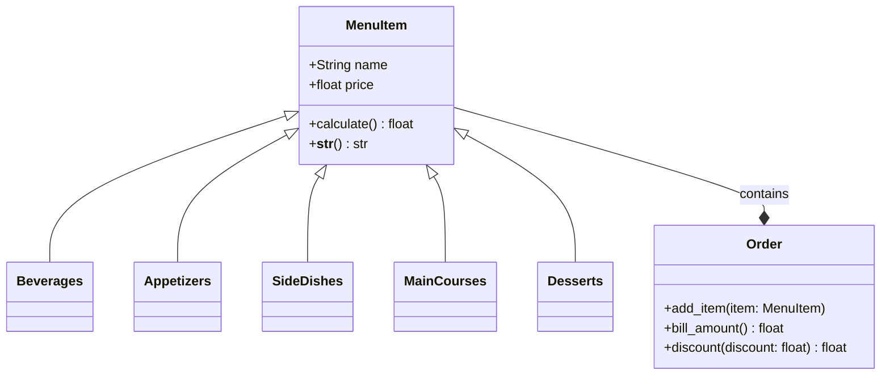

## Estudiante: `Santiago Gamboa Martínez`

### Ejercicio 1:

<details><summary>Descripción - Ejercicio de la Clase</summary>

1. Create a repo with the class exercise

- `length`, `slope`, `start`, `end`: Instance attributes, two of them being points (so a line is composed at least of two points).

- _compute_length()_: should return the line´s length.

- _compute_slope()_: should return the slope of the line from tje horizontal in deg.

- _compute_horizontal_cross()_: should return if exists the intersection with x-axis.

- _compute_vertical_cross()_: should return if exists the intersection with y-axis.

- Redefine the class Rectangle, adding a new method of initialization using 4 Lines (composition at its best, a rectangle is compose of 4 lines).

Optional: Define a method called discretize_line() that creates an array on n equally spaced points in the line and assigned as a instance attribute.

## Clase Línea



</details>

---

## Explicación del Código - Clase Line

La clase Line representa una línea en un espacio bidimensional y hereda de la clase Point. Aquí está la explicación detallada de la clase Line:
La clase Line hereda de Point y representa una línea definida por dos puntos en un espacio bidimensional.

Constructor `__init__`:

```
def __init__(self, start, end, n: int = 2):
        if not isinstance(start, Point) or not isinstance(end, Point):
            raise ValueError("Los puntos deben ser instancias de la clase Point")

        self.start = start
        self.end = end
        super().__init__(start.x, start.y)
        self.length = self.compute_length()
        self.slope = self.compute_slope()
        self.discretize_points = self.discretize_line(n)
```

### Parámetros:

- `start`: Punto de inicio de la línea (debe ser una instancia de Point).

- `end`: Punto final de la línea (debe ser una instancia de Point).

- `n`: Número de divisiones para discretizar la línea (por defecto es 2).

### Validación:

Verifica que start y end sean instancias de Point. Si no lo son, lanza un `ValueError`.

### Inicialización:

- Asigna `start` y `end` a los atributos de la instancia.

- Llama al constructor de la clase `Point` con las coordenadas de `start`.

- Calcula la longitud de la línea llamando a `compute_length` y la asigna a `self.length`.

- Calcula la pendiente de la línea llamando a `compute_slope` y la asigna a `self.slope`.

- Discretiza la línea en n puntos llamando a `discretize_line` y la asigna a `self.discretize_points`.

### Métodos de la clase Line

La clase Line tiene varios métodos que no se muestran en el fragmento proporcionado, pero se mencionan en el contexto anterior:

- `compute_length`: Calcula la longitud de la línea.

- `compute_slope`: Calcula la pendiente de la línea.

- `discretize_line`: Divide la línea en n puntos equidistantes.

- `compute_horizontal_cross`: Calcula la intersección de la línea con el eje horizontal.

- `compute_vertical_cross`: Calcula la intersección de la línea con el eje vertical.

Estos métodos permiten realizar varias operaciones geométricas con la línea, como calcular su longitud, pendiente y puntos de intersección con los ejes.

## Pruebas

**Geogebra:**

### Línea


Estas son sus cordenadas:


Esta es la longiud de la línea:


Esta es la pendiente de la línea en grados:


La línea intersecciona en el eje X, pero no intersecciona en el eje Y:


Ejecución del programa:


---



---

### Ejercicio 2:

<details><summary>Descripción - Ejercicio de Scenario Restaurant</summary>

2. Restaurant scenario: You want to design a program to calculate the bill for a customer's order in a restaurant.

- Define a base class MenuItem: This class should have attributes like `name`, `price`, and a method to calculate the total price.

- Create subclasses for different types of menu items: Inherit from MenuItem and define properties specific to each type (e.g., `Beverage`, `Appetizer`, `MainCourse`).

- Define an Order class: This class should have a list of MenuItem objects and methods to add items, calculate the total bill amount, and potentially apply specific discounts based on the order composition.

Create a class diagram with all classes and their relationships. The menu should have at least 10 items. The code should follow PEP8 rules.

</details>

---

### Relación MenuItem - Types of MenuItems

Relación de Herencia `(<|--)`

La clase MenuItem actúa como una clase base, de la cual heredan las clases:

- `Beverages`

- `Appetizers`

- `SideDishes`

- `MainCourses`

- `Desserts`

Esto implica que todas estas subclases tendrán los atributos y métodos definidos en MenuItem.



---

### Relación MenuItem - Order

Relación de Composición `(--*)`:

La clase Order contiene instancias de MenuItem, indicando que un pedido está compuesto por varios ítems del menú.

Métodos en Order:

- _add_item(item: MenuItem)_: Agrega un ítem al pedido.

- _bill_amount()_: Calcula el monto total del pedido.

- _discount(discount: float)_: Aplica un descuento al monto total.



---

### Diagrama Completo


